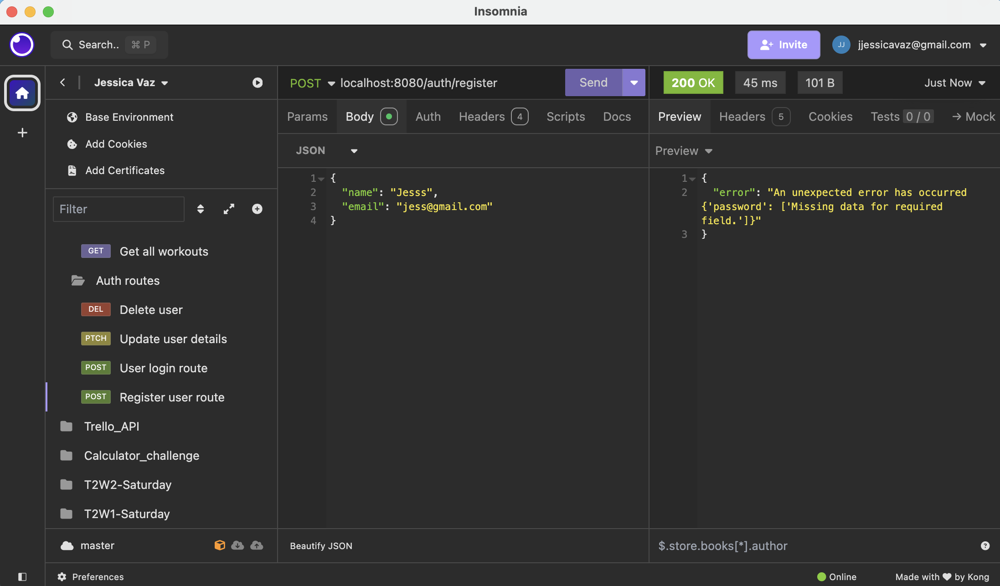
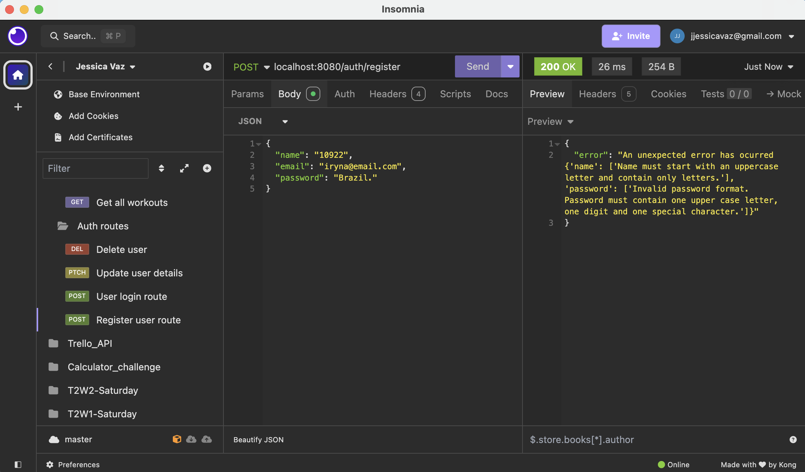

# JessicaVaz_T2A2

Requirements

R1 - Explain the problem that this app will solve, and explain how this app solves or addresses the problem.

R2 - Describe the way tasks are allocated and tracked in your project.

R3 - List and explain the third-party services, packages and dependencies used in this app.

R4 - Explain the benefits and drawbacks of this app’s underlying database system.

R5 - Explain the features, purpose and functionalities of the object-relational mapping system (ORM) used in this app.

R6 - Design an entity relationship diagram (ERD) for this app’s database, and explain how the relations between the diagrammed models will aid the database design. This should focus on the database design BEFORE coding has begun, eg. during the project planning or design phase.

R7 - Explain the implemented models and their relationships, including how the relationships aid the database implementation.

This should focus on the database implementation AFTER coding has begun, eg. during the project development phase.

# R8 

## USERS endpoints

### Route for users to register:
	- Route: localhost:8080/auth/register
	- Method: POST
	- Body required : Name, email and password and is_admin. 
	- Requirements for name, email and password.

### Example of body of request:
	{
	"name": "Jess",
	"email": "jess@email.com",
	"password": "Brazil1."
	}

### Response
When request is successful, user will see their info displayed apart from password. Http response will be 201 created. Example:

	{
	"id": 4,
	"name": "Jess",
	"email": "Jess@email.com",
	"is_admin": false,
	"workouts": [],
	"group_logs": [],
	"group_created": {}
	}

### Possible error msgs users can receive when registering:
- Unique email violation: “error": "Email address must be unique
- Name violation: error": "An unexpected error has occurred {'name': ['Name must be between 2 and 30 characters in length.']}"
- Email violation: error": "An unexpected error has occurred {'email': ['Invalid email format: The email cannot have consecutive dots, must have a local part, a non-empty domain name, and a top-level domain containing at least two letters. Valid characters include letters, numbers, underscore, period, percent sign, plus sign, and hyphen.']}"
- Password violation: "error": "An unexpected error has occurred {'password': ['Invalid password format. Password must contain one upper case letter, one digit and one special character.']}"
- Missing fields violation: "error": "An unexpected error has occurred {'password': ['Missing data for required field.']}"

### Route for user login
	- Route: localhost:8080/auth/login
	- Method: POST
	- Body request: Email and password

### Example of body of request:

	{
	"email": "jess@email.com",
	"password": "Brazil1."
	}

### Response
When a user logs in, the application will return the user's email and token. Example of a response body:
	
	"email": "jess@email.com",
	"token": "eyJhbGciOiJIUzI1NiIsInR5cCI6IkpXVCJ9.eyJmcmVzaCI6ZmFsc2UsImlhdCI6MTcyNzUwODE1OCwianRpIjoiYjkyYWYwZTYtNjRkYS00YTQ2LThiY2QtY2I2Yzk5OGMyMDRlIiwidHlwZSI6ImFjY2VzcyIsInN1YiI6IjQiLCJuYmYiOjE3Mjc1MDgxNTgsImNzcmYiOiIwNDAxYmUxMi1jNmI2LTQwMzMtODU4Ny1mMThhOTk4NTAzZDQiLCJleHAiOjE3Mjc1OTQ1NTh9 4E2n4B6g-22o-U_QKWs0MXsBcEt7NOVLLi_-O9B7CxE"
	

### Possible error msgs users can receive when logging in:
- Invalid credentials: "error": "Invalid credentials"
- Missing fields: "error": "Email and password are required.”

### Route for user to update their details
	- Route: localhost:8080/auth/login
	- Method: POST
	- Body request: Name, email or password.
	- JWT token is required in the authorisation header

### Example of body of request:
	“name”: “Jessica”,
	"email": "jess@email.com"

### Response
When request is successful, the new updated details will be displayed back to users, apart from password. Example:

	{
	"id": 4,
	"name": "Jessica Vaz",
	"email": "jessica.vaz@email.com",
	"is_admin": false,
	"workouts": [],
	"group_logs": [],
	"group_created": {}
	}

### Possible error messages: 
- Unique email error msg. 
- Email, password and name violations.

### Delete user route
Users can delete themselves and admin users can delete regular users.

	- Route: localhost:8080/auth/users/<user_id>
	- Parameter: user_id. 
	- Method: Delete
	- JWT is required in the authorisation header

### Response 

When request is successful, it will display an acknowledgement message back to user. Example:

	{
	"message": "Jess with ID number 6 has been successfully deleted."	
	}

## Workouts endpoints

Only the user can see, update and delete their workout sessions.

### Route to see workout logs
	- Route: localhost:8080/workouts/
	- Method: GET
	- JWT token is required in the authorisation header

### Response
When request is successful user will see all workouts sessions logged in the app. Example:

	{
	"id": 1,
	"title": "Outside run",
	"date": "2024-09-28",
	"distance_kms": 10,
	"calories_burnt": 235,
	"user": {
		"id": 1,
		"name": "User A"
	}
	},
	{
	"id": 3,
	"title": "Treadmill",
	"date": "2024-09-28",
	"distance_kms": 4,
	"calories_burnt": 500,
	"user": {
		"id": 1,
		"name": "User A"
	}
	}

### Possible errors: 
- Not authenticated user.
- User hasn’t logged a workout yet, a personalised error msg will be displayed back to user. 

### Route to see a specific workout log
	- Route: localhost:8080/workouts/<workout_id>
	- Method: GET
	- Parameter: <workout_id>
	- JWT token is required in the authorisation header

### Response
When the request is successful, the specific workout will be displayed to user. Example:
	
	"id": 1,
	"title": "Outside run",
	"date": "2024-09-28",
	"distance_kms": 10,
	"calories_burnt": 235,
	"user": {
		"id": 1,
		"name": "User A"
	}

### Possible errors: 
- Not authenticated user.
- Not found workout log, personalised msg will be displayed back to user.

### Route to log a workout session
	- Route: localhost:8080/workouts/
	- Method: POST
	- Body required: title, distance_kms, calories_burnt(Optional).
	- JWT token is required in the authorisation header.

### Body of request eg:
	{
	"title": "Outside run",
	"distance_kms":"20"
	}

### Response
When request is successful, the log will be displayed back to the user. Example:

	"id": 15,
	"title": "Outside run",
	"date": "2024-09-28",
	"distance_kms": 20,
	"calories_burnt": null,
	"user": {
		"id": 7,
		"name": "Jess"
	}

### Possible errors: 
- Integrity violation, missing distance_kms. 
- Data error, wrong data input for distance_kms and calories_burnt. 
- Data violation for title attribute, title received a different input from one of the allowed options.

### Route to update a workout log
	- Route: localhost:8080/workouts/<workout_id>
	- Method: PATCH/ PUT
	- Parameter: <workout_id>
	- Required body: Attribute user wish to update (title, distance_kms or calories_burnt).
	- JWT token is required in the authorisation header.

### Body of request eg:
	{
	"title": "Outside walk",
	"distance_kms":"5"
	}

### Response: 
When request is successful, the new update log will be displayed back to user. Example:

	"id": 15,
	"title": "Outside walk",
	"date": "2024-09-28",
	"distance_kms": 20,
	"calories_burnt": 550,
	"user": {
		"id": 7,
		"name": "Jess"
	}

### Possible errors:
- Workout not found 
- Data violations

### Route to delete a specific workout log
	- Route: localhost:8080/workouts/<workout_id>
	- Method: DELETE
	- Parameter: <workout_id>
	- JWT token is required in the authorisation header.

### Response: 
When request is successful, an acknowledgment msg will be returned to user. Example:
	
	"message": "Workout 4 has been deleted successfully!"	
	

### Possible errors: 
- Workout not found
- Not authorised user

## Groups endpoints

## Routes users to see created groups
- Route: localhost:8080/groups
- Method: GET
- JWT token is required in the authorisation header.

### Response: 
When request is successful, the groups will be displayed back to user. Example:

	{
	"id": 1,
	"name": "Australian Team",
	"date_created": "2024-09-29",
	"created_by": 1,
	"group_admin": {
		"name": "User A"
	},
	"group_logs": [],
	"marathon_logs": []
	},
	{
	"id": 2,
	"name": "Coder Team",
	"date_created": "2024-09-29",
	"created_by": 2,
	"group_admin": {
		"name": "User B"
	},
	"group_logs": [],
	"marathon_logs": []
	}

### Route to see a specific group
- Route: localhost:8080/groups/<group_id>
- Method: GET
- JWT token is required in the authorisation header.

### Response: 
When request is successful, the group will be displayed back to user. Example:

	{
	"id": 2,
	"name": "Coder Team",
	"date_created": "2024-09-29",
	"created_by": 2,
	"group_admin": {
		"name": "User B"
	}
	}
	
### Possible errors:
- User not authenticated
- Group or groups doesn't exist yet

### Create group (only admins allowed, one group per admin)

- Route: localhost:8080/groups/register
- Method: POST
- Requested body: Name
- JWT token is required in the authorisation header.

### Response: 
When request is successful, the created group will be displayed back to admin user. Example:

	{
	"id": 5,
	"name": "Coder Team",
	"date_created": "2024-09-29",
	"created_by": 1,
	"group_admin": {
		"name": "User A"
	},
	"group_logs": [],
	"marathon_logs": []
	}

### Possible errors:
- Not admin user
- Admin already has created one group
- Name Violation

### Route to update groups info (only admin allowed)

- Route: localhost:8080/groups/<group_id>
- Method: POST
- Parameter: <group_id>
- Requested body: Name
- JWT token is required in the authorisation header.

## Body of request:

	{
	"name": "Girls Run"
	}

### Response: 

When request is successful, the updated group will be displayed back to admin user. Example:
	{
	"id": 3,
	"name": "Girls Run",
	"date_created": "2024-09-29",
	"created_by": 1,
	"group_admin": {
		"name": "User A"
	},
	"group_logs": [],
	"marathon_logs": []
	}

### Possible errors:
- Not authorised user
- Not authorised admin (admins can only update their own group)
- Group name violations

### Route to delete a group (only admin allowed)

- Route: localhost:8080/groups/<group_id>
- Method: DELETE
- Parameter: <group_id>
- JWT token is required in the authorisation header.

### Response: 

When request is successful, an acknowledgment msg will be displayed back to admin user. Example:
	{
	"message": "Group 4 has been deleted successfully!"
	}	

### Possible errors:
- Group not found
- Not authorised user
- Not authorised admin (admins can only delete their own group)

### Route for regular members to sign up to a group
- Route: localhost:8080/groups/<group_id>/join
- Method: POST
- Parameter: <group_id>
- JWT token is required in the authorisation header.

### Response

When request is successful, an acknowledgment msg will be displayed back to user. Example:
	{
	"message": "Luke is officially part of the group named Group A."
	}

### Possible errors:
- Group doesn't exist
- Already a member of the requested group
- User not authenticated
- Admin one group violation

### Route for regular members to unsubscribe from a group
- Route: localhost:8080/groups/<group_id>/unsubscribe
- Method: DELETE
- Parameter: <group_id>
- JWT token is required in the authorisation header.

### Response

When request is successful, an acknowledgment msg will be displayed back to user. Example:
	{
	"message": "You have successfully left the group named Group B."
	}

### Possible errors:
- Group not found
- Not a group member
- Admin cannot leave their own group

## Marathons routes

## Routes users to see marathons events
- Route: localhost:8080/marathons
- Method: GET
- JWT token is required in the authorisation header.

### Response: 
When request is successful, the groups will be displayed back to user. Example:
{
	"id": 2,
	"name": "Coder Run",
	"event_date": "2025-10-08",
	"location": "Melbourne",
	"distance_kms": 20,
	"marathon_logs": [
		{
			"id": 1,
			"entry_created": "2024-09-29"
		}
	]
},
{
	"id": 1,
	"name": "Marathon A",
	"event_date": "2026-12-12",
	"location": "Gold Coast",
	"distance_kms": 10,
	"marathon_logs": [
		{
			"id": 2,
			"entry_created": "2024-09-29"
		}
	]
}

### Possible errors:
- Marathons has not been created yet
- Not authenticated user

### Route to see a specific marathon
- Route: localhost:8080/marathons/<marathon_id>
- Method: GET
- JWT token is required in the authorisation header.

### Response: 
When request is successful, the requested marathon will be displayed back to user. Example:

	{
	"id": 1,
	"name": "Marathon A",
	"event_date": "2026-12-12",
	"location": "Gold Coast",
	"distance_kms": 10,
	"marathon_logs": 
		{
			"id": 2,
			"entry_created": "2024-09-29"
		}
	}
	
- Specific marathon does not exist
- Not authenticated user

### Route to create marathons (only admin allowed, they can create as many as they wish).
- Route: localhost:8080/marathons/register
- Method: POST
- Body of request: Name, event_date, location and distance_kms.
- JWT token is required in the authorisation header.

### Example of body of request
	{
	"name": "Coder Marathon",
	"event_date": "2025-12-01",
	"location": "12 O'Connor, Melbourne",
	"distance_kms": "15"	
	}

### Response

When request is successful, the marathon event will be displayed back to user. Example:
	{
	"id": 4,
	"name": "Coder Marathon",
	"event_date": "2025-12-01",
	"location": "12 O'Connor, Melbourne",
	"distance_kms": 15,
	"marathon_logs": []
	}

### Possible errors:
- Not authenticated user
- Not admin
- Name, event date, location, and distance violations

### Route to update marathons events, (only admins allowed, all admins can edit info related to all marathon events.)
- Route: localhost:8080/marathons/register
- Method: POST
- Parameter: <marathon_id>
- Body of request: Attributes admin wants to update, it can include: name, event date, location and distance.
- JWT token is required in the authorisation header.

### Example of a body of request:
	{
	"location" : "Opera house, Sydney"
	}

### Body of response
When request is successful, the new marathon info will be displayed back to admin user. Example:	
	{
	"id": 4,
	"name": "Coder Marathon",
	"event_date": "2025-12-01",
	"location": "Opera house, Sydney",
	"distance_kms": 15,
	"marathon_logs": []
	}

### Possible errors:
- Not authenticated user 
- Not admin
- Marathon does not exist
- Name, event date, location, and distance violations

### Route to delete marathons events, (only admins allowed, admins can delete all marathon events.)
- Route: localhost:8080/marathons/<marathon_id>
- Method: DELETE
- Parameter: <marathon_id>
- JWT token is required in the authorisation header.

### Response
When request is successful, an acknowledgment msg will be displayed back to admin user. Example:

	{
	"message": "Coder Marathon event has been deleted successfully!"
	}

### Possible errors:
- Not authenticated user
- Not admin
- Requested marathon event does not exist

## Route to enrol groups in the marathons events, (only admins allowed, each admin can enrol their own group in the marathon events).
- Route: localhost:8080/marathons/<marathon_id>/signup
- Method: POST
- Parameter: <marathon_id>
- JWT token is required in the authorisation header.

### Response
When request is successful, the log entry containing group and marathon event information will be displayed back to the admin. Example:

{
	"id": 4,
	"entry_created": "2024-09-29",
	"group": {
		"id": 1,
		"name": "Group A",
		"date_created": "2024-09-29",
		"created_by": 1,
		"group_admin": {
			"name": "User A"
		},
		"group_logs": [
			{
				"id": 1,
				"entry_created": "2024-09-29",
				"user": {
					"id": 1,
					"name": "User A",
					"email": "admin_a@email.com"
				}
			}
		]
	},
	"marathon": {
		"id": 4,
		"name": "Coder Marathon",
		"event_date": "2025-12-01",
		"location": "12 O'Connor, Melbourne",
		"distance_kms": 15
	}
}

### Possible errors:
- Not authenticated user
- Not admin
- Already enrolled the group in the required marathon
- Admin hasn't created a group yet
- Marathon requested event doesn't exist

## Route to remove the group from marathon event(only admin can perform this task, and they are only allowed to remove their own group)
- Route: localhost:8080/<marathon_id>/logs/<log_id>
- Method: DELETE
- Parameter: <marathon_id>, <log_id>
- JWT token is required in the authorisation header.

### Response
When request is successful, an acknowledgment msg will be sent back to admin. Example:
	{
	"message": "Group A has been successfully removed from Marathon B event."
	}

### Possible errors:
- Not authenticated user
- Not the admin who created the group
- Group hasn't enrolled for that specific marathon event

